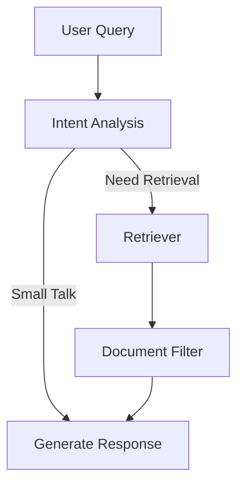

# 🇲🇬 RAG Avancé sur Madagascar avec LangGraph & Gemini


---

Application RAG (Retrieval-Augmented Generation) avancée et contrôlable basée sur la page Wikipédia de Madagascar. Ce projet utilise un workflow déterministe construit avec **LangGraph** pour orchestrer l'interrogation, le filtrage et la génération de réponses. L'application est servie via une API **FastAPI**, utilise **Qdrant** comme base de données vectorielle et **Gemini** comme modèle de langage.

Le but est de fournir un système de questions-réponses fiable, précis et sans hallucination, en s'appuyant sur des stratégies d'ingestion et d'évaluation rigoureuses.

## 🏛️ Architecture du Workflow LangGraph

Contrairement à un agent autonome classique qui peut être imprévisible, cette application utilise une architecture de graphe orientée et déterministe. Chaque étape est un nœud discret avec une responsabilité unique, garantissant un contrôle total sur le flux de données et réduisant drastiquement les risques d'hallucination.

Le workflow se déroule en 4 étapes principales :

1.  **`intent_detection`**: Analyse la question de l'utilisateur pour déterminer son intention (question factuelle, conversation, etc.) et sa langue. Cela permet de décider si une recherche dans la base de connaissance est nécessaire.
2.  **`retriever`**: Si une recherche est nécessaire, ce nœud interroge la base de données vectorielle **Qdrant** pour récupérer les documents (chunks de texte et de tableaux) les plus pertinents par rapport à la question.
3.  **`document_filter`**: Un nœud critique qui examine les documents récupérés. Il rejette les documents non pertinents pour éviter de polluer le contexte du générateur. Cette étape est essentielle pour la précision et la fiabilité de la réponse finale.
4.  **`generator`**: Le nœud final qui prend la question et les documents filtrés pour générer une réponse claire, factuelle et synthétique en s'appuyant exclusivement sur les sources fournies.



### Endpoints de l'API

L'interaction avec le RAG se fait via les endpoints suivants :

#### `POST /chat`

Endpoint principal pour poser des questions au RAG.
- **Gestion des conversations** : L'API gère les conversations en utilisant un `thread_id`. Si aucun ID n'est fourni, un nouveau est créé. Cela permet de conserver l'historique des échanges pour des interactions contextuelles.
- **Sources et Métadonnées** : La réponse inclut non seulement le texte généré mais aussi une liste de sources précises (section et sous-section de la page Wikipédia) utilisées pour formuler la réponse, garantissant la traçabilité et la vérifiabilité.

#### `POST /add`

Endpoint pour l'ingestion et le rafraîchissement des données.
- **Ajout de nouvelles données** : Permet d'ingérer des données depuis une nouvelle URL Wikipédia.
- **Rafraîchissement** : L'option `refresh: true` dans le payload supprime toutes les données existantes avant d'ingérer le nouveau contenu. C'est crucial pour les sources de données qui changent fréquemment.

## 🛠️ Pipeline d'Ingestion & Chunking Hybride

La qualité d'un RAG dépend fortement de la qualité de ses données. Un soin particulier a été apporté au traitement de la page Wikipédia de Madagascar.

### Stratégie de Chunking du Texte
Le contenu textuel est découpé de manière hiérarchique. Le script d'ingestion parcourt le HTML et identifie les sections `<h2>` et `<h3>`. Chaque paragraphe est stocké comme un `Document` distinct, avec les titres des sections parentes comme métadonnées (`h2_section`, `h3_section`). Cela permet au `retriever` de cibler des passages très spécifiques et de fournir un contexte riche.

### Stratégie de Chunking des Tableaux
Les tableaux (ex: démographie, économie) sont souvent une source de réponses précises mais difficiles à traiter pour les modèles d'embedding.
La stratégie adoptée est la suivante :
1.  **Transformation en format textuel** : Chaque tableau HTML est converti en texte brut. Chaque ligne du tableau devient une chaîne de caractères au format `Clé 1: Valeur 1 | Clé 2: Valeur 2...`.
2.  **Découpage par paquets** : Pour ne pas surcharger les embeddings, les tableaux sont découpés en paquets de 10 lignes. Chaque paquet est un `Document` indépendant dans la base vectorielle, tout en conservant les métadonnées de la section où il se trouve.

Cette approche garantit que la sémantique des tableaux est correctement capturée et facilement exploitable par le modèle de langage.

## 🚀 Guide d'Installation & Lancement

### Prérequis
- Python 3.10+
- Clé API Google Gemini
- Docker (pour lancer Qdrant localement)

### 1. Variables d'Environnement

Créez un fichier `.env` à la racine du projet et ajoutez votre clé API Gemini :

```
GEMINI_API_KEY="VOTRE_CLE_API_ICI"
```

### 2. Installation des dépendances

```bash
pip install -r requirements.txt
```

### 3. Lancement de Qdrant

Vous pouvez utiliser une instance Cloud de Qdrant ou en lancer une localement via Docker :

```bash
docker run -p 6333:6333 -p 6334:6334 qdrant/qdrant
```

### 4. Ingestion des données

L'ingestion des données se fait en appelant l'endpoint `POST /add` avec l'URL de la page Wikipédia à traiter.

**Exemple d'ingestion initiale :**

```bash
curl -X POST "http://localhost:8000/add" \
-H "Content-Type: application/json" \
-d '{
  "url": "https://en.wikipedia.org/wiki/Madagascar"
}'
```

**Exemple pour rafraîchir les données (supprime les anciennes données avant d'ingérer les nouvelles) :**

```bash
curl -X POST "http://localhost:8000/add" \
-H "Content-Type: application/json" \
-d '{
  "url": "https://en.wikipedia.org/wiki/Madagascar",
  "refresh": true
}'
```

### 5. Lancement de l'API FastAPI

```bash
uvicorn main:app --reload
```

L'API sera disponible à l'adresse `http://localhost:8000`.

### 6. Exemple de Requête

Voici un exemple de requête `curl` pour interroger l'API :

```bash
curl -X POST "http://localhost:8000/chat" \
-H "Content-Type: application/json" \
-d '{
  "message": "Quelle est la population de Madagascar ?",
  "thread_id": "mon-thread-123"
}'
```

## 📊 Suite d'Évaluation (RAG Evaluation)

L'évaluation est une composante clé de ce projet. Elle est divisée en deux approches complémentaires.

### Évaluation Humaine / Notebook
Le notebook `notebook/human_evaluation.ipynb` fournit un cadre pour l'évaluation manuelle. Il contient une quinzaine de questions variées conçues pour tester les limites du RAG :
- **Faits simples** : Questions directes sur des informations présentes dans le texte.
- **Chiffres & Données** : Interrogation sur des données spécifiques (population, superficie).
- **Tableaux** : Questions nécessitant la lecture et l'interprétation de données tabulaires.
- **Hors périmètre** : Questions dont la réponse ne se trouve pas dans le document pour tester la capacité du modèle à admettre son ignorance.

### Évaluation Automatisée (LLM-as-a-Judge)
Le script `evaluation/evaluate_llm_judge.py` automatise l'évaluation en utilisant un modèle de langage comme juge. Le processus est le suivant :
1.  Le script itère sur un jeu de données d'évaluation (`evaluation/dataset_eval.py`).
2.  Pour chaque question, il interroge l'API RAG locale pour obtenir une réponse et les sources.
3.  Il utilise ensuite un second LLM (le "Juge") pour comparer la réponse de l'agent avec la "vérité terrain" (réponse et source attendues).
4.  L'évaluation est structurée grâce à un modèle Pydantic (`EvaluationOutput`) qui force le juge à noter la réponse selon 5 métriques précises sur une échelle de 0 à 5.

Les métriques évaluées sont :
- `retriever_score` : Pertinence des documents récupérés.
- `relevance_score` : Pertinence de la réponse par rapport à la question.
- `correctness_score` : Exactitude factuelle de la réponse.
- `faithfulness_score` : Absence d'hallucination (la réponse est-elle bien ancrée dans les sources ?).
- `precision_score` : La réponse est-elle concise et sans information superflue ?

### Rapport des Résultats

L'exécution du script `evaluate_llm_judge.py` génère un fichier `EVALUATION.md` contenant un tableau de bord des performances.

[Consulter le Rapport d'Évaluation Détaillé (EVALUATION.md)](./EVALUATION.md)


## 🗺️ Roadmap & Améliorations Futures

- **Persistance des Conversations** : Remplacer le `MemorySaver` actuel (stockage en mémoire volatile) par une solution robuste comme `PostgresSaver` ou `RedisSaver`. C'est une étape indispensable pour une mise en production et pour gérer plusieurs instances de l'application.
- **Recherche Hybride Avancée** : Intégrer une recherche hybride combinant la recherche sémantique (dense, via Gemini embeddings) avec une recherche par mots-clés (sparse, ex: BM25). La fusion des résultats via RRF (Reciprocal Rank Fusion) permettrait d'améliorer encore la pertinence du retriever.

## 🌳 Arborescence du Projet

```
.gitignore
.env.example
Dockerfile
main.py
README.md
requirements.txt
app/
├── __init__.py
├── core/
│   ├── agent_manager.py
|   ├── dependencies.py
│   └── settings.py
├── db/
│   └── vector_store.py
├── graph/
│   ├── __init__.py
│   ├── nodes/
│   │   ├── document_filter.py
│   │   ├── generator.py
│   │   ├── intent_analysis.py
│   │   └── retriever.py
│   ├── state.py
|   └── workflow.py
├── schemas/
│   ├── chat.py
│   └── ingestion.py
├── services/
│   └── ingestion_flow.py
└── utils/

evaluation/
├── dataset_eval.py
├── evaluate_llm_judge.py
└── data/

notebook/
├── human_evaluation.ipynb
└── ingestion.ipynb
```
